# ErrorLens.ErrorHandling -- Architecture Guide

This document provides a comprehensive architectural overview of the **ErrorLens.ErrorHandling** library, a structured error handling framework for ASP.NET Core APIs. It covers the package structure, middleware pipeline, dependency injection graph, handler chain of responsibility, configuration system, and all cross-cutting concerns.

> **Version covered:** 1.3.1
> **Target frameworks:** .NET 6.0 through .NET 10.0 (multi-targeting)
> **Language:** C# 12

---

## Table of Contents

1. [Package Structure](#1-package-structure)
2. [High-Level Architecture](#2-high-level-architecture)
3. [Error Handling Pipeline Flow](#3-error-handling-pipeline-flow)
4. [Dependency Injection Registration](#4-dependency-injection-registration)
5. [Handler Chain of Responsibility](#5-handler-chain-of-responsibility)
6. [Configuration Architecture](#6-configuration-architecture)
7. [Attribute System and Metadata Caching](#7-attribute-system-and-metadata-caching)
8. [Serialization and Response Writing](#8-serialization-and-response-writing)
9. [ProblemDetails Generation (RFC 9457)](#9-problemdetails-generation-rfc-9457)
10. [Localization Architecture](#10-localization-architecture)
11. [Telemetry and Distributed Tracing](#11-telemetry-and-distributed-tracing)
12. [Rate Limiting Integration](#12-rate-limiting-integration)
13. [OpenAPI / Swagger Integration](#13-openapi--swagger-integration)
14. [Multi-Targeting Strategy](#14-multi-targeting-strategy)
15. [Key Design Decisions](#15-key-design-decisions)
16. [Public Interface Catalog](#16-public-interface-catalog)

---

## 1. Package Structure

The solution ships as **three NuGet packages**, each with a distinct responsibility and target framework range.

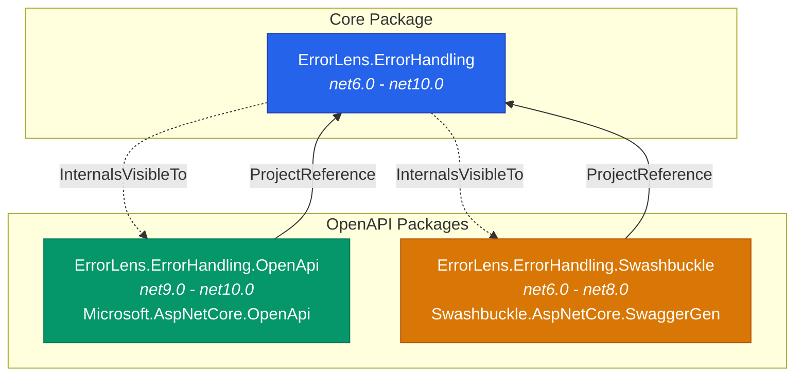

| Package | Target Frameworks | Purpose |
|---|---|---|
| **ErrorLens.ErrorHandling** | net6.0 - net10.0 | Core middleware, handlers, mappers, models, configuration, localization, telemetry, rate limiting, serialization |
| **ErrorLens.ErrorHandling.OpenApi** | net9.0 - net10.0 | `IOpenApiOperationTransformer` integration for the native .NET 9+ OpenAPI pipeline |
| **ErrorLens.ErrorHandling.Swashbuckle** | net6.0 - net8.0 | `IOperationFilter` integration for Swashbuckle/Swagger on older frameworks |

Both OpenAPI packages share the **internal** `ErrorResponseSchemaGenerator` class from the core package (via `InternalsVisibleTo`), ensuring schema generation logic is defined once.

### Core Package Directory Layout

```
src/ErrorLens.ErrorHandling/
  Attributes/              -- ResponseErrorCode, ResponseStatus, ResponseErrorProperty
  Configuration/           -- ErrorHandlingOptions, enums, JsonFieldNamesOptions, validator
  Extensions/              -- ServiceCollection, ApplicationBuilder, ConfigurationBuilder
  Handlers/                -- IApiExceptionHandler chain + AbstractApiExceptionHandler
  Integration/             -- Middleware, IExceptionHandler, ErrorResponseWriter
  Internal/                -- ExceptionMetadataCache, StringUtils
  Localization/            -- IErrorMessageLocalizer + NoOp + StringLocalizer bridge
  Mappers/                 -- IErrorCodeMapper, IErrorMessageMapper, IHttpStatusMapper
  Models/                  -- ApiErrorResponse, ApiFieldError, ApiGlobalError, ApiParameterError
  OpenApi/                 -- ErrorResponseSchemaGenerator, OpenApiOptions (internal)
  ProblemDetails/          -- IProblemDetailFactory, ProblemDetailFactory, ProblemDetailResponse
  RateLimiting/            -- IRateLimitResponseWriter, DefaultRateLimitResponseWriter, options
  Serialization/           -- ApiErrorResponseConverter (custom JSON field names)
  Services/                -- ErrorHandlingFacade, ILoggingService, LoggingService,
                              IApiErrorResponseCustomizer, ILoggingFilter
  Telemetry/               -- ErrorHandlingActivitySource
```

---

## 2. High-Level Architecture

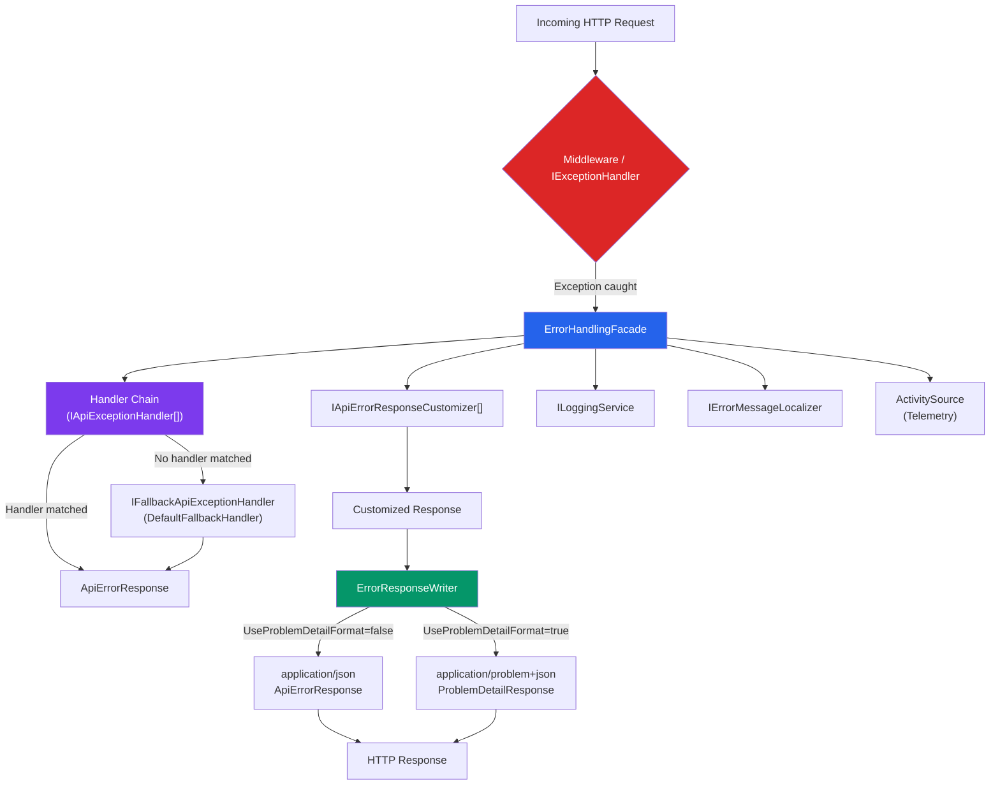

The architecture follows a **Facade pattern** at its core. The `ErrorHandlingFacade` orchestrates handler selection, customization, logging, localization, and telemetry enrichment. The `ErrorResponseWriter` handles format selection (standard JSON vs. RFC 9457 Problem Details) and serialization with cached `JsonSerializerOptions`.

---

## 3. Error Handling Pipeline Flow

This diagram shows the complete lifecycle of an exception from throw to HTTP response.

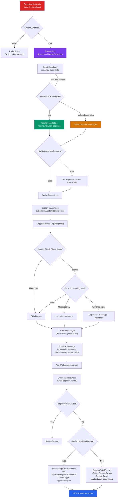

### Key pipeline behaviors

- **Guard clause:** If `Enabled` is `false`, the exception is rethrown preserving the original stack trace via `ExceptionDispatchInfo.Capture().Throw()`.
- **Handler safety net:** If any handler throws during processing, the facade catches it, logs both exceptions, and returns a safe 500 response (`INTERNAL_SERVER_ERROR` / `"An unexpected error occurred"`) to prevent information leakage.
- **Response-already-started guard:** `ErrorResponseWriter` checks `HttpContext.Response.HasStarted` before writing, preventing `InvalidOperationException` when headers have already been sent.

---

## 4. Dependency Injection Registration

The `AddErrorHandling()` extension method on `IServiceCollection` registers all core services. The registration uses `TryAdd*` methods throughout to enable idempotent calls and allow user overrides.

```mermaid
graph TD
    subgraph Entry Points
        AEH1["AddErrorHandling()"]
        AEH2["AddErrorHandling(Action&lt;Options&gt;)"]
        AEH3["AddErrorHandling(IConfiguration)"]
    end

    AEH1 --> AEH2
    AEH2 --> BIND["Bind 'ErrorHandling' section<br/>+ apply Action configure"]
    AEH3 --> BIND3["Bind IConfiguration section"]
    BIND --> RCS["RegisterCoreServices()"]
    BIND3 --> RCS

    subgraph RegisterCoreServices
        direction TB
        RCS --> VAL["IValidateOptions&lt;ErrorHandlingOptions&gt;<br/>ErrorHandlingOptionsValidator"]
        RCS --> ECM["IErrorCodeMapper -> ErrorCodeMapper"]
        RCS --> EMM["IErrorMessageMapper -> ErrorMessageMapper"]
        RCS --> HSM["IHttpStatusMapper -> HttpStatusMapper"]
        RCS --> LS["ILoggingService -> LoggingService"]
        RCS --> LOC["IErrorMessageLocalizer -> NoOpErrorMessageLocalizer"]
        RCS --> FBH["IFallbackApiExceptionHandler -> DefaultFallbackHandler"]

        RCS --> H1["IApiExceptionHandler: 6 built-in handlers"]

        RCS --> ABO["ApiBehaviorOptions<br/>(conditional ModelState override)"]
        RCS --> FAC["ErrorHandlingFacade"]
        RCS --> PDF["IProblemDetailFactory -> ProblemDetailFactory"]
        RCS --> ERW["ErrorResponseWriter"]
        RCS --> MWR["ErrorHandlingMiddleware"]

        RCS --> RL["IRateLimitResponseWriter<br/>DefaultRateLimitResponseWriter<br/><i>(NET7_0_OR_GREATER)</i>"]
        RCS --> EXH["IExceptionHandler<br/>ErrorHandlingExceptionHandler<br/><i>(NET8_0_OR_GREATER)</i>"]
    end

    subgraph User Extension Points
        UH["AddApiExceptionHandler&lt;T&gt;()"]
        UC["AddErrorResponseCustomizer&lt;T&gt;()"]
        UL["AddErrorHandlingLocalization&lt;T&gt;()"]
    end

    UH -->|TryAddEnumerable| H1
    UC -->|TryAddEnumerable| CUS["IApiErrorResponseCustomizer"]
    UL -->|Replace| LOC2["StringLocalizerErrorMessageLocalizer&lt;T&gt;"]

    style RCS fill:#2563eb,color:#fff
    style FAC fill:#7c3aed,color:#fff
    style ERW fill:#059669,color:#fff
```

### Registration semantics

| Method | Idempotency | Notes |
|---|---|---|
| `TryAddSingleton<I, T>` | First registration wins | Used for mappers, logging, facade, writer |
| `TryAddEnumerable(Singleton<I, T>)` | One per concrete type | Used for handlers and customizers |
| `Replace(ServiceDescriptor)` | Overwrites existing | Used by `AddErrorHandlingLocalization<T>()` |
| `AddExceptionHandler<T>()` | Framework method | .NET 8+ `IExceptionHandler` registration |

All services are registered as **Singleton**. They resolve `IOptions<ErrorHandlingOptions>.Value` once in their constructors, meaning configuration values are frozen at first resolution.

---

## 5. Handler Chain of Responsibility

Handlers implement `IApiExceptionHandler` and are ordered by their `Order` property (ascending -- lower values execute first). The facade iterates through them calling `CanHandle()` until one matches. If none match, the `IFallbackApiExceptionHandler` handles the exception.

```mermaid
graph LR
    EX["Exception"] --> AGG

    subgraph Handler Chain - sorted by Order
        AGG["AggregateExceptionHandler<br/>Order: 50"]
        MSV["ModelStateValidation<br/>ExceptionHandler<br/>Order: 90"]
        VEH["ValidationException<br/>Handler<br/>Order: 100"]
        JEH["JsonException<br/>Handler<br/>Order: 120"]
        TMH["TypeMismatch<br/>ExceptionHandler<br/>Order: 130"]
        BRH["BadRequest<br/>ExceptionHandler<br/>Order: 150"]
    end

    AGG -->|CanHandle=false| MSV
    MSV -->|CanHandle=false| VEH
    VEH -->|CanHandle=false| JEH
    JEH -->|CanHandle=false| TMH
    TMH -->|CanHandle=false| BRH
    BRH -->|CanHandle=false| FB["DefaultFallbackHandler<br/>(catch-all)"]

    style AGG fill:#7c3aed,color:#fff
    style FB fill:#d97706,color:#fff
```

| Handler | Order | Exception Type | Status Code | Error Code |
|---|---|---|---|---|
| `AggregateExceptionHandler` | 50 | `AggregateException` | Delegates to inner | Re-dispatches |
| `ModelStateValidationExceptionHandler` | 90 | `ModelStateValidationException` | 400 | `VALIDATION_FAILED` |
| `ValidationExceptionHandler` | 100 | `ValidationException` | 400 | `VALIDATION_FAILED` |
| `JsonExceptionHandler` | 120 | `JsonException` | 400 | `MESSAGE_NOT_READABLE` |
| `TypeMismatchExceptionHandler` | 130 | `FormatException`, `InvalidCastException` | 400 | `TYPE_MISMATCH` |
| `BadRequestExceptionHandler` | 150 | `BadHttpRequestException` | from exception | `BAD_REQUEST` |
| `DefaultFallbackHandler` | N/A | Any | Attribute / mapper | Attribute / mapper |

**Custom handlers** added via `AddApiExceptionHandler<T>()` participate in the same chain. The `AbstractApiExceptionHandler` base class provides `Order => 1000` by default and a `CreateResponse()` helper.

### AggregateException unwrapping

`AggregateExceptionHandler` flattens nested aggregates via `Flatten()`. If there is exactly **one** inner exception, it lazily resolves handlers from `IServiceProvider` (to break circular DI), skips itself to prevent recursion, and re-dispatches to the chain. Multi-exception aggregates are delegated to the fallback handler.

---

## 6. Configuration Architecture

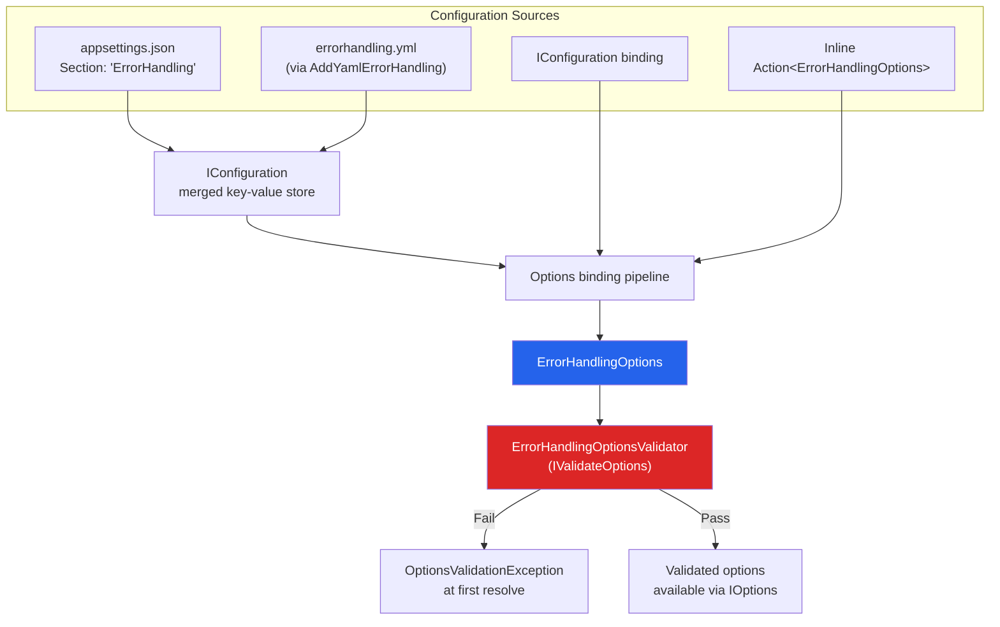

### Configuration binding order

1. `IConfiguration` section binding runs first (from `appsettings.json`, YAML, environment variables, etc.)
2. The inline `Action<ErrorHandlingOptions>` runs second, so it can override file-based values.

### Options validation

`ErrorHandlingOptionsValidator` runs at first `IOptions<ErrorHandlingOptions>` resolution and validates:
- All `JsonFieldNamesOptions` properties are non-null and non-whitespace.
- All field name values are unique (no duplicates like `code` and `message` mapped to the same JSON key).

### ErrorHandlingOptions properties

| Property | Type | Default | Description |
|---|---|---|---|
| `Enabled` | `bool` | `true` | Enable/disable error handling globally |
| `DefaultErrorCodeStrategy` | `ErrorCodeStrategy` | `AllCaps` | `AllCaps` or `FullQualifiedName` |
| `HttpStatusInJsonResponse` | `bool` | `false` | Include HTTP status code in JSON body |
| `SearchSuperClassHierarchy` | `bool` | `false` | Search base classes for config matches |
| `AddPathToError` | `bool` | `true` | Include property path in field errors |
| `OverrideModelStateValidation` | `bool` | `false` | Intercept `[ApiController]` validation |
| `UseProblemDetailFormat` | `bool` | `false` | Enable RFC 9457 Problem Details format |
| `ProblemDetailTypePrefix` | `string` | `https://example.com/errors/` | Type URI prefix for Problem Details |
| `ProblemDetailConvertToKebabCase` | `bool` | `true` | Convert error codes to kebab-case in type URI |
| `ExceptionLogging` | `ExceptionLogging` | `MessageOnly` | `None`, `MessageOnly`, `WithStacktrace` |
| `HttpStatuses` | `Dictionary<string, HttpStatusCode>` | `{}` | Exception FQN to HTTP status mappings |
| `Codes` | `Dictionary<string, string>` | `{}` | Exception FQN or field-specific error code mappings |
| `Messages` | `Dictionary<string, string>` | `{}` | Exception FQN or field-specific message mappings |
| `LogLevels` | `Dictionary<string, LogLevel>` | `{}` | HTTP status code/range to log level |
| `FullStacktraceHttpStatuses` | `HashSet<string>` | `{}` | HTTP statuses that force full stack trace logging |
| `FullStacktraceClasses` | `HashSet<string>` | `{}` | Exception types that force full stack trace logging |
| `JsonFieldNames` | `JsonFieldNamesOptions` | *(defaults)* | Custom JSON field names (10 configurable fields) |
| `RateLimiting` | `RateLimitingOptions` | *(defaults)* | Rate limiting response options |
| `OpenApi` | `OpenApiOptions` | `DefaultStatusCodes: {400, 404, 500}` | OpenAPI schema generation options |

---

## 7. Attribute System and Metadata Caching

Three attributes allow exception classes to declare their error response behavior declaratively:

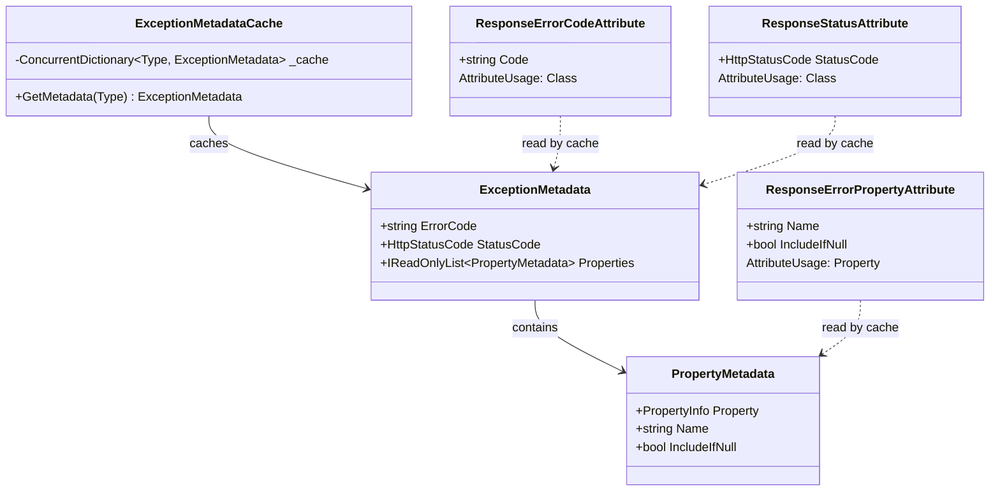

`ExceptionMetadataCache` is a **static, thread-safe** `ConcurrentDictionary` that reflects on exception types once and caches the results. The `DefaultFallbackHandler` consults this cache to:

1. Use `[ResponseErrorCode]` as the error code (overrides the `IErrorCodeMapper` strategy).
2. Use `[ResponseStatus]` as the HTTP status code (overrides the `IHttpStatusMapper`).
3. Extract `[ResponseErrorProperty]`-decorated properties and add them to `ApiErrorResponse.Properties` (serialized via `[JsonExtensionData]`).

Property names default to camelCase conversion of the C# property name unless overridden via the `Name` parameter.

---

## 8. Serialization and Response Writing

`ErrorResponseWriter` caches a single `JsonSerializerOptions` instance at construction, including the custom `ApiErrorResponseConverter`. This avoids per-request allocation.

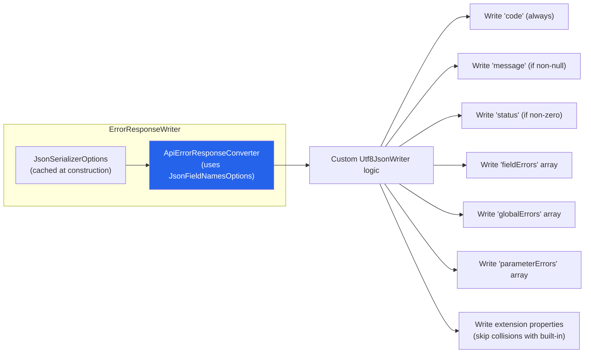

`ApiErrorResponseConverter` is a **write-only** `JsonConverter<ApiErrorResponse>` that:

- Uses the configured `JsonFieldNamesOptions` to determine property names at every level.
- Manually writes each nested error model (`ApiFieldError`, `ApiGlobalError`, `ApiParameterError`) with the correct field names.
- Filters `Properties` (extension data) to avoid collisions with built-in field names.
- The `JsonSerializerOptions` instance becomes thread-safe after first serialization.

---

## 9. ProblemDetails Generation (RFC 9457)

When `UseProblemDetailFormat` is `true`, `ErrorResponseWriter` delegates to `IProblemDetailFactory`.

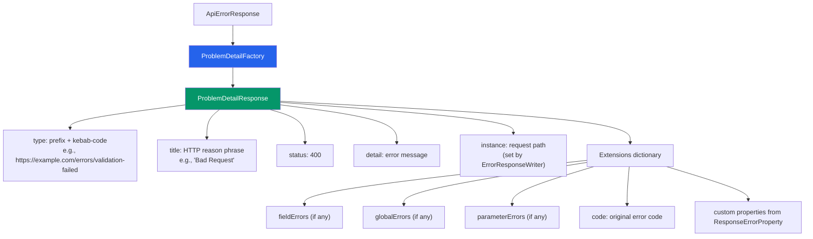

The `type` URI is built from `ProblemDetailTypePrefix` + the error code converted to kebab-case (e.g., `VALIDATION_FAILED` becomes `validation-failed`). This is configurable via `ProblemDetailConvertToKebabCase`.

---

## 10. Localization Architecture

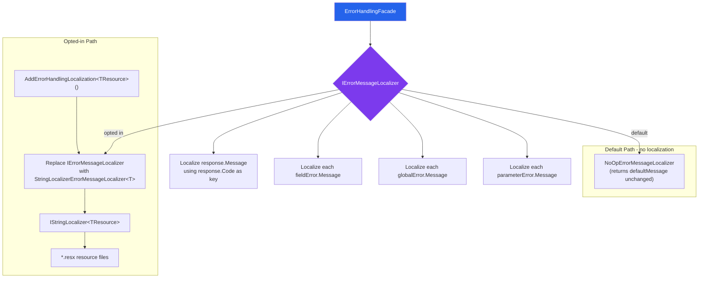

Localization is a **zero-cost opt-in**. The default `NoOpErrorMessageLocalizer` is a pass-through. When the user calls `AddErrorHandlingLocalization<TResource>()`:

1. `AddLocalization()` is called to register the Microsoft localization infrastructure.
2. The `IErrorMessageLocalizer` registration is **replaced** with `StringLocalizerErrorMessageLocalizer<TResource>`.
3. Error codes are used as resource keys in `.resx` files. If no resource is found, the default message is returned.

Localization runs **after** handler processing and customization in the `ErrorHandlingFacade`, so it localizes the final message.

---

## 11. Telemetry and Distributed Tracing

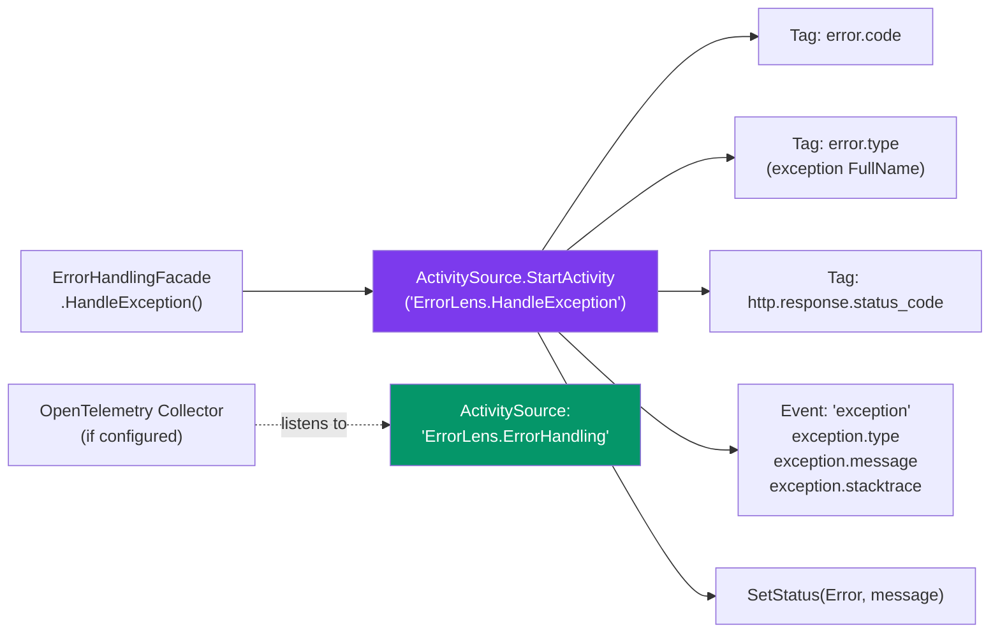

`ErrorHandlingActivitySource` exposes a static `ActivitySource` named `"ErrorLens.ErrorHandling"`. The facade:

1. Starts an activity named `"ErrorLens.HandleException"` for each exception.
2. Only enriches tags/events when `activity.IsAllDataRequested == true` (zero overhead when no collector is configured).
3. Uses OTel semantic conventions for exception events (`exception.type`, `exception.message`, `exception.stacktrace`).
4. Sets `ActivityStatusCode.Error` on the activity.

---

## 12. Rate Limiting Integration

Available on **.NET 7+** only (guarded by `#if NET7_0_OR_GREATER`).

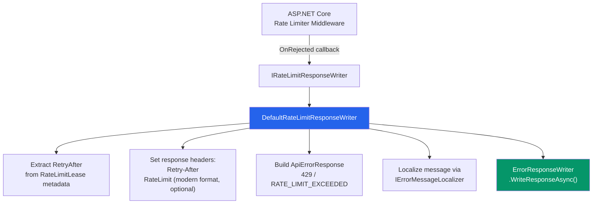

The `DefaultRateLimitResponseWriter`:

- Reads `MetadataName.RetryAfter` from the `RateLimitLease`.
- Sets `Retry-After` header (always when metadata available).
- Optionally sets the combined `RateLimit` header (IETF draft format) via `UseModernHeaderFormat`.
- Optionally includes `retryAfter` in the JSON body via `IncludeRetryAfterInBody`.
- Delegates body serialization to the shared `ErrorResponseWriter` (same format/field name logic).

---

## 13. OpenAPI / Swagger Integration

The library provides two parallel packages for API documentation, split by framework generation.

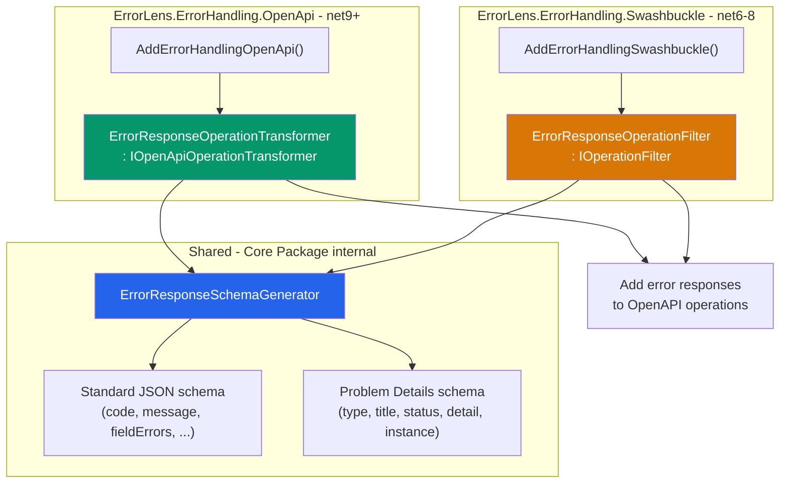

Both integrations:

- Skip status codes already declared on the operation (e.g., via `[ProducesResponseType]`).
- Add error response schemas for each status code in `OpenApiOptions.DefaultStatusCodes` (default: 400, 404, 500).
- Choose between standard and Problem Details schemas based on `UseProblemDetailFormat`.
- Use the configured `JsonFieldNamesOptions` for property names in the standard schema.

---

## 14. Multi-Targeting Strategy

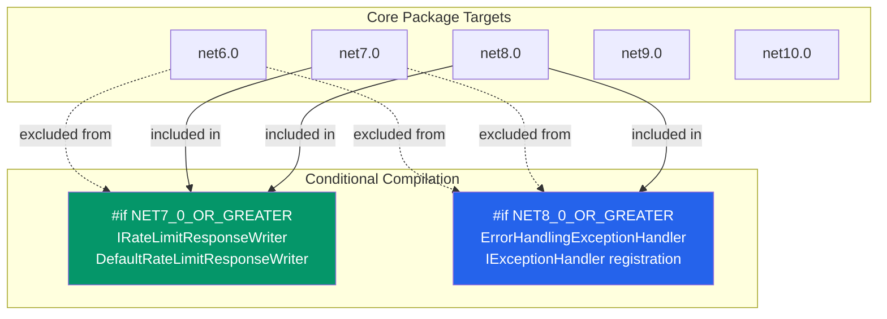

| Feature | .NET 6 | .NET 7 | .NET 8+ |
|---|---|---|---|
| Middleware (`UseErrorHandling()`) | Required | Required | Optional |
| `IExceptionHandler` | N/A | N/A | Auto-registered |
| Rate limiting integration | N/A | Available | Available |

The `System.Threading.RateLimiting` NuGet package reference is conditionally excluded on `net6.0` via a `Condition` attribute in the `.csproj`.

---

## 15. Key Design Decisions

### 1. Facade Pattern over Mediator
The `ErrorHandlingFacade` centralizes orchestration rather than using a mediator or event bus. This keeps the call path predictable, debuggable, and synchronous.

### 2. Chain of Responsibility with Explicit Ordering
Handlers use a numeric `Order` property rather than framework-level ordering attributes. Built-in handlers use values 50-150, leaving `Order < 50` for high-priority custom handlers and `Order > 150` (default 1000) for standard custom handlers.

### 3. TryAdd for Idempotent Registration
All DI registrations use `TryAddSingleton` or `TryAddEnumerable`, meaning:
- Calling `AddErrorHandling()` multiple times is safe.
- Users can register their own `IErrorCodeMapper` (etc.) **before** calling `AddErrorHandling()` to override defaults.

### 4. Zero-Cost Abstractions for Optional Features
- **Localization:** `NoOpErrorMessageLocalizer` is a pass-through; no allocation or lookup occurs.
- **Telemetry:** `Activity` tags are only set when `IsAllDataRequested == true` (no collector = no cost).
- **Customizers:** Empty `IEnumerable<IApiErrorResponseCustomizer>` means zero iterations.

### 5. Cached Serialization Options
`ErrorResponseWriter` creates its `JsonSerializerOptions` (including the custom `ApiErrorResponseConverter`) once at construction. This avoids per-request allocation.

### 6. Security by Default
- 5xx errors in `DefaultFallbackHandler` always return `"An unexpected error occurred"` to prevent information disclosure.
- `BadRequestExceptionHandler` sanitizes messages containing framework-internal type names (`Microsoft.*`, `System.*`).

### 7. Static Metadata Cache
`ExceptionMetadataCache` uses a static `ConcurrentDictionary` to avoid repeated reflection on exception types. This is a process-lifetime cache that grows monotonically (appropriate for the bounded set of exception types in any application).

### 8. Separate OpenAPI Packages by Framework Generation
Rather than using conditional compilation within a single package, the library ships separate packages: `.OpenApi` for .NET 9+ and `.Swashbuckle` for .NET 6-8. Both share the internal `ErrorResponseSchemaGenerator`.

---

## 16. Public Interface Catalog

### Core Interfaces

| Interface | Namespace | Purpose |
|---|---|---|
| `IApiExceptionHandler` | `Handlers` | Chain of responsibility handler; implement to handle specific exception types |
| `IFallbackApiExceptionHandler` | `Handlers` | Catch-all handler when no specific handler matches |
| `IErrorCodeMapper` | `Mappers` | Maps exceptions to error code strings |
| `IErrorMessageMapper` | `Mappers` | Maps exceptions to human-readable messages |
| `IHttpStatusMapper` | `Mappers` | Maps exceptions to HTTP status codes |
| `ILoggingService` | `Services` | Logs exception handling events |
| `ILoggingFilter` | `Services` | Filters which exceptions should be logged |
| `IApiErrorResponseCustomizer` | `Services` | Global post-processing hook for all error responses |
| `IErrorMessageLocalizer` | `Localization` | Localizes error messages by error code |
| `IProblemDetailFactory` | `ProblemDetails` | Creates RFC 9457 responses from `ApiErrorResponse` |
| `IRateLimitResponseWriter` | `RateLimiting` | Writes structured 429 responses (.NET 7+) |

### Core Classes

| Class | Namespace | Purpose |
|---|---|---|
| `AbstractApiExceptionHandler` | `Handlers` | Base class with `Order => 1000` and `CreateResponse()` helper |
| `ErrorHandlingFacade` | `Services` | Central orchestrator for the entire pipeline |
| `ErrorResponseWriter` | `Integration` | Writes JSON/Problem Details to `HttpContext.Response` |
| `ErrorHandlingMiddleware` | `Integration` | `IMiddleware` for .NET 6/7 |
| `ErrorHandlingExceptionHandler` | `Integration` | `IExceptionHandler` for .NET 8+ |
| `ApiErrorResponse` | `Models` | Primary error response model |
| `ApiFieldError` | `Models` | Field-level validation error |
| `ApiGlobalError` | `Models` | Class-level validation error |
| `ApiParameterError` | `Models` | Method parameter validation error |
| `ProblemDetailResponse` | `ProblemDetails` | RFC 9457 response model |
| `ErrorHandlingActivitySource` | `Telemetry` | Static `ActivitySource` for OTel tracing |
| `ApiErrorResponseConverter` | `Serialization` | Custom JSON converter for configurable field names |

### Extension Methods

| Method | Class | Purpose |
|---|---|---|
| `AddErrorHandling()` | `ServiceCollectionExtensions` | Register all core services |
| `AddApiExceptionHandler<T>()` | `ServiceCollectionExtensions` | Register custom exception handler |
| `AddErrorResponseCustomizer<T>()` | `ServiceCollectionExtensions` | Register response customizer |
| `AddErrorHandlingLocalization<T>()` | `ServiceCollectionExtensions` | Opt into IStringLocalizer-based localization |
| `UseErrorHandling()` | `ApplicationBuilderExtensions` | Add middleware to pipeline (required .NET 6/7) |
| `AddYamlErrorHandling()` | `ConfigurationBuilderExtensions` | Add YAML configuration source |
| `AddErrorHandlingOpenApi()` | `OpenApiServiceCollectionExtensions` | Add .NET 9+ OpenAPI schemas |
| `AddErrorHandlingSwashbuckle()` | `SwaggerServiceCollectionExtensions` | Add Swashbuckle operation filter |

### Attributes

| Attribute | Target | Purpose |
|---|---|---|
| `[ResponseErrorCode("CODE")]` | Class (Exception) | Override error code for an exception type |
| `[ResponseStatus(HttpStatusCode)]` | Class (Exception) | Override HTTP status for an exception type |
| `[ResponseErrorProperty]` | Property (on Exception) | Include property value in error response JSON |
